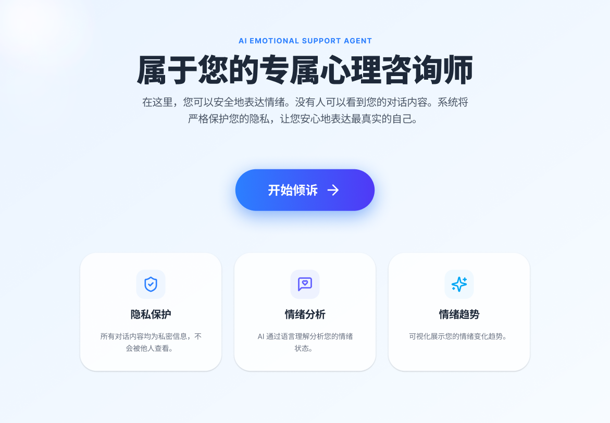
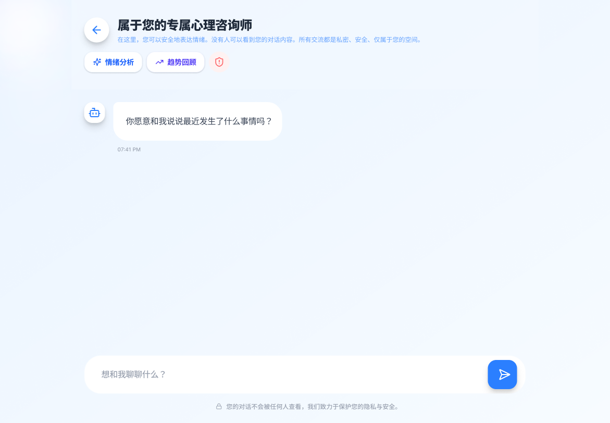
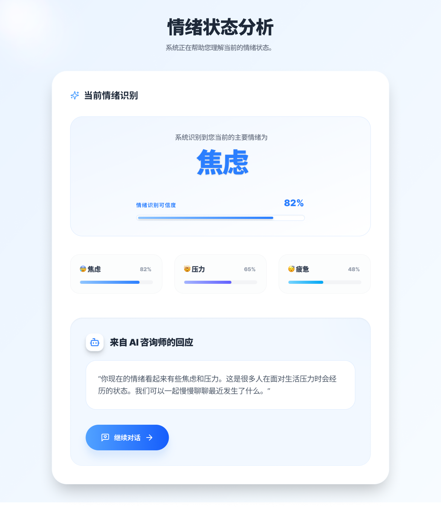
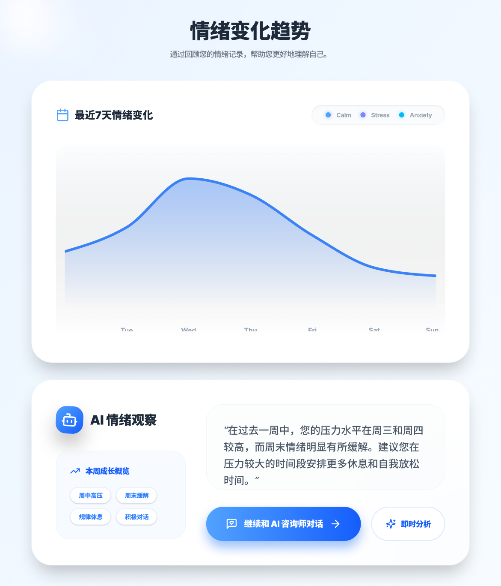

# Emotional Support Companion —— AI 情感支持对话产品
AI-Powered Emotional Support Web Application

🔗 Product Prototype / 产品原型演示：https://sync-lair-09050008.figma.site

---

**Product Screenshots 产品截图**

**首页 / Landing**


**对话页 / Chat**


**情绪状态分析 / Emotion Analysis**


**情绪变化趋势 / Emotion Trends**


---

**What is this? 这是什么**

一款基于 Next.js + TypeScript 开发的 AI 情感支持应用，探索 AI 在心理健康
支持场景中的产品形态与 Human-AI Interaction 设计。用户可在私密、安全的环境
中表达情绪，系统提供情绪识别、分析与可视化趋势追踪。

A Next.js web application exploring how AI can provide meaningful emotional 
support through conversational interaction, emotion recognition, and mood 
trend visualization — with a privacy-first design approach.

---

**Core Features 核心功能**

- 💬 对话页：私密安全的 AI 情感支持对话，情绪标签识别
- 📊 情绪分析页：识别当前主要情绪状态（焦虑 / 压力 / 疲意等），可信度评分
- 📈 情绪趋势页：7天情绪变化曲线 + AI 情绪观察与行为建议
- 🔒 隐私保护：所有对话内容私密，底部持续展示隐私承诺

---

**Product Thinking 产品思路**

核心问题：**AI 如何在高敏感度场景中建立用户信任，提供有温度且有边界感的支持？**

- 隐私优先设计：从产品层面（不只是技术层面）建立用户信任
- 情绪可视化：把抽象的情绪状态转化为用户可理解的洞察
- AI 边界意识：情绪分析结果配合 AI 观察，而非直接给出诊断
- 低压力交互：柔和的视觉语言，减少用户在高压场景中的使用障碍

---

**Current Stage & Next Steps 当前阶段与下一步**

当前已完成 / Completed：
- ✅ 完整前端代码实现（Next.js + TypeScript，4个页面全部开发完成）
- ✅ 首页 / 对话页 / 情绪分析页 / 情绪趋势页
- ✅ Figma Make UI 交互原型
- ✅ 隐私优先的产品交互设计

待实现 / Next Steps：
- 🔲 接入 LLM API 实现真实 AI 对话回复
- 🔲 情绪分析模型集成（替换当前 mock 数据）
- 🔲 用户数据持久化与真实趋势计算

---

**Tech Stack 技术栈**

Next.js (App Router) · TypeScript · CSS · Lucide Icons  
Figma Make (UI Prototype) · Conversational UX · Human-AI Interaction Design

---

**Pages 页面结构**

- `app/page.tsx` 首页 / Landing
- `app/chat/` 对话页 / Chat
- `app/analysis/` 情绪分析页 / Emotion Analysis  
- `app/trends/` 情绪趋势页 / Emotion Trends
- `components/` 共用组件库

---

**My Role 我的角色**

独立完成产品定义、Figma UI 原型设计与 Next.js 前端开发全流程  
Independently completed product definition, Figma prototype, and full Next.js front-end development

- AI 情感支持场景的产品需求定义与用户流程设计
- 隐私优先的产品交互设计（Privacy-first UX）
- 情绪识别、分析与趋势追踪的信息架构设计
- Next.js + TypeScript 前端完整实现
- Conversational UX 与 Human-AI Interaction 设计探索

---

**Local Setup 本地运行**
```bash
npm install
npm run dev
# 打开 http://localhost:3000
```

---

**Contact 联系方式**

Email: zz3378@tc.columbia.edu  
GitHub: https://github.com/zoezhuy
